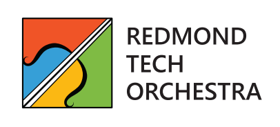
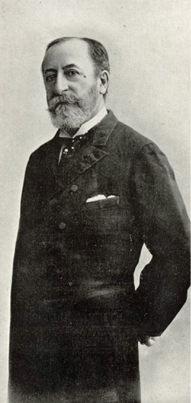
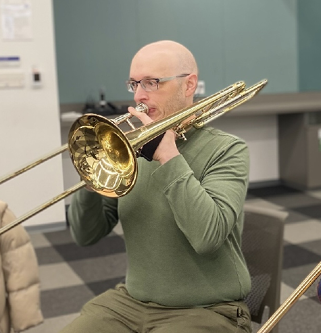
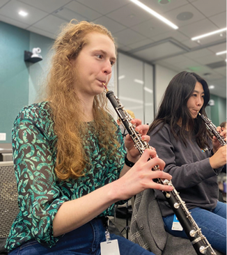
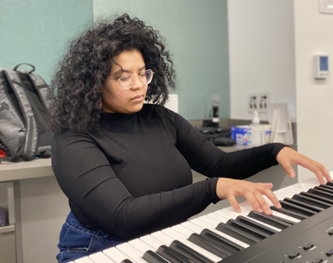

<h1 style="border-bottom: 0">Starting with Saint-Saëns</h1>
<h2 style="margin-top: -25px">Our Inaugural Concert</h2>  

March 30th, 2024  
Carlson Theatre  
Bellevue College

<h2 style="text-align: center"> Program </h2>

Dmitri Shostakovich — Waltz No. 2  [4 min.]  
Aaron Copland — "Hoe-down" from *Rodeo* [4 min.]  
Camille Saint-Saëns — Bacchanale from *Samson and Delilah* [8 min.]  
Camille Saint-Saëns — Danse Macabre [8 min.]  

#### *Intermission*  

Camille Saint-Saëns — Symphony No. 3 [40 min.]

<h2 style="text-align: center"> Program Notes </h2>

Today, the Redmond Tech Orchestra is thrilled to present a program of musical masterpieces that showcase the breadth and depth of our art form.  

The concert opens with **Waltz No. 2**, the 7th movement of the Suite for Variety Orchestra. Dmitri Shostakovich is one of the greatest 20th century composers, known for his emotional extremes and technical inventions. Although primarily attributed to Shostakovich, the suite is actually an arrangement of themes from his other works. The music for the second waltz comes from Shostakovich’s film score for The First Echelon, a 1955 romance film taking place during the Soviet War. The complete suite was arranged by Levon Atovmyan, a close friend of Shostakovich. It is unclear when the suite was specifically finished, but it was written in the late 1950s, and did not receive a properly documented performance until 1988 by the London Symphony Orchestra. Since then, the waltz has been widely performed and recorded, despite some critics finding it overly sentimental.

Next, Aaron Copland's ballet *Rodeo* celebrates the American West. It tells the story of a cowgirl seeking the affections of the Head Wrangler, who, like many of the local cowboys, is captivated by the more feminine Rancher's Daughter.Throughout the ballet she is rejected by the Head Wrangler and ends up alone until a fellow cowboy invites her to dance. In Hoe-Down, we experience the cow- girl’s rebirth: she has put aside her cowpoke duds and reappeared as the prettiest girl in the room. The ballet was choreographed by Agnes de Mille and premiered at the Metropolitan Opera House on October 16, 1942. *Rodeo* was a groundbreaking work that combined classical ballet with American folk music and cowboy culture. In this uplifting last movement of the ballet, Copland borrows from various folks tunes: *Bonaparte’s Retreat*, *Miss McLeod’s Reel*, and *Gilderoy*. It has since become one of America’s most recognizable pieces of music, used in various contexts such as films, TV shows and commercials.  

The next set of pieces capture the works of Camille Saint-Saëns. The three-act opera *Samson and Delilah* portrays the story of Samson, presented as an inspiring Israelite leader rather than a Biblical supernatural warrior, and Delilah the beautiful, manipulative, and ruthless Philistine maiden. Delilah seduces Samson and learns the secret of his strength (his hair) and has him captured by Philistine soldiers. In the third and final Act of the opera, as the Philistines are preparing a sacrifice to celebrate their victory, Delilah leads a wild and seductive dance, the **Bacchanale**.

 
  
 

Taking its name from the Roman god of wine and fertility, a bacchanale is a dance that portrays sensuality and abandon. Following the dance, Samson's prayer for one last surge of strength is granted and he dislodges the temple pillars, bringing the roof down on the godless crowd and himself. First performed in 1877, the opera was initially met with negativity due to its biblical subject matter, but gained popularity in the 1890s. It has remained moderately popular since the early 20th century and is now considered part of the standard symphonic performance repertoire.  

Before stepping into intermission, we dive into **Danse Macabre**, a symphonic poem by Camille Saint-Saëns that premiered on January 24, 1875. It is based on the French legend where Death packs a fiddle, represented here as a solo violin, and plays at midnight on Halloween, causing the skeletons in the cemetery to crawl out of the ground for their annual graveyard dance party. There are various images that can be heard in this piece: in the opening, the harp plays a single note twelve times signifying the twelve strokes of midnight. The solo violin enters playing a tritone, known as the “Devil’s interval”. Midway through the piece, Dies Irae, a Gregorian chant theme from the Requiem Mass used by composers to sum- mon scenes of death and judgment, is introduced in an unusual major key. The coda of the piece represents the breaking of dawn and with a cockerel’s crow, the skeletons return to their graves. While initially met with anxiety and criticism, it is now considered one of Saint-Saëns’ masterpieces and has been widely used in popular culture.  

Finally, we conclude the program with one of Camille Saint-Saëns' most renowned works, **Symphony No. 3**. This symphony was commissioned by the Royal Philharmonic Society in England, completed in 1886, and dedicated to the memory of Franz Liszt, a friend and mentor of Saint-Saëns. Also known as the “Organ Symphony,” it features two movements with prominent organ parts, making it unique among late-Romantic symphonies. Saint-Saëns considered this work a culmination of his career and an opportunity to innovate upon traditional symphonic scoring practices. Despite being asked to compose another symphony, he never returned to the genre. Variations on the *Dies Irae* theme can be heard throughout the piece, alongside virtuosic piano passages, brilliant orchestral writing, and the grand sound of the organ.  

Join us as we take you on a journey through the ages, exploring the beauty, passion, and creativity that only classical music can provide!

<h2 style="text-align: center"> About the Orchestra </h2>

Welcome to the Redmond Tech Orchestra (RTO), a revived initiative that brings together the musical talents of local tech employees!  

Our mission is to enrich the cultural landscape of our community by providing high-quality performances, educational programs, and outreach initiatives. We strive to make music accessible to all, fostering a love of music that will be passed down for generations to come.  

Founded by Peter Yang (conductor), Emily Jin (violin, bassoon), and Sicheng Zeng (Flute, Organ) in late December, our group largely consists of employees from various teams, levels, and disciplines across Microsoft, united by our shared love of music. You may recognize Peter, who orchestrated and conducted Microsoft the Musical back in 2019. Through this musical, he met Emily, who performed in the musical and is now a co-lead and participating musician!  

Our members possess diverse talents, such as Roxanne Kenison’s ability to play multiple instruments, including the clarinet, fiddle, and tenor saxophone, and Mirabai Smoot’s lifelong passion for the violin, which she began playing at just three years old.  

We’d like to also highlight some of our talented soloists from today’s performance. Starting off, we have Cole Brooking, our low brass section leader! Cole recently celebrated his 15th anniversary at Microsoft and has a rich musical background. He picked up the trombone in middle school and played in various ensembles throughout college. You will hear him playing the trombone solos in Shostakovich’s Waltz No. 2 and Copland’s Hoe-down!
 
  
 
Next, get ready to be captivated by Jennifer Williams' enchanting opening solo from the Bacchanale! Jennifer joined Microsoft in July 2023 after graduating from the University of Michigan and now works as a software engineer in the Microsoft News area. She began playing the oboe in middle school and continued performing in various orchestras and bands throughout high school and college.  

 
  
 

Our ensemble members have dedicated themselves over the past few months to harmonize together as a brand new orchestra. Our performers are not only working hard as musicians, but also as leaders, organizers, and content creators. The commitment of our members truly made the music come alive.  

Tonight’s concert marks the beginning of our musical journey as the Redmond Tech Orchestra, and we plan to expand our repertoire and recruit more musicians from the community. Thank you for joining us for our inaugural concert! We hope to create a memorable night that leaves a lasting impression!

## Support Us

Please support us by donating and following us on social media!  

([PayPal](https://www.paypal.com/donate/?hosted_button_id=FMGNWMZECNGZE)) ([Venmo](https://www.venmo.com/u/redmondtechorchestra))  ([Facebook](https://www.facebook.com/profile.php?id=61557022596926))  ([Instagram](https://www.instagram.com/redmondtechorchestra))

## Musician Roster

#### 1st Violin

Rachel Keirouz  
Brandon Chen  
Jerry He  
Emily Jin\*  
Sophie Zhao\*

#### 2nd Violin

Mirabai Smoot  
Erica Choi  
Ryan Solorzano  
Gabriel Mallari  
Sophie Zhao\*  

#### Viola

Henry Wang  
Anita Ambalavanan  
Sean Park  
Jasmin Lim  

#### Cello

Rodrigo Ramirez  
Alaina Bossert  
Adrian Pang  
Rebecca Kreitinger  

#### Bass

Tanya Lai  
Joseph Haule  

#### Piano/Organ

Jada Campbell  
Sicheng Zeng\*  

#### Piccolo

Alex Ayala\*  
Nandhini Lakuduva\*  

#### Flute

Sonya Lao  
Nandhini Lakuduva\*  
Alex Ayala\*  
Jennifer Lee  
Britania Reyes  
Jin Kim  
Yoona Oh  
Su Min Kim  
Sicheng Zeng\*  

#### Oboe

Jennifer Williams  
Sandy Moon  

#### Clarinet

Vicky Harp  
David Chen  
Kathleen Zhou  

#### Bass Clarinet

Joanna Chu  

#### Bassoon

Emily Jin\*  

#### Alto Sax

Adithya Mukund  
John Storgion  
Zichang Su  

#### Tenor Sax

Ethan Wong  
Roxanne Kenison  

#### Horn

Caeli MacLennan  
Linda Brooking  
Jose Carpio  

#### Trumpet

Sven Boemer  
Ayush Vikram  
Jessica Nguyen  

#### Trombone

Cole Brooking  
Kirsten Clemens  
Stefan Smolen  

#### Euphonium

Stephen Manz  

#### Percussion

Matthew Kangas  
Cato Mar  
Enrique Saurez  

\* Doubling on multiple instruments or parts

<h2 style="text-align: center"> Looking Ahead</h2>

Kick off your summer in style! We are thrilled to announce a preview of our next concert in approximately three months. Prepare to be captivated by the spellbinding notes of George Gershwin’s legendary **Rhapsody in Blue**, masterfully performed by Jada Campbell. Be ready to immerse yourself in the vibrant fusion of jazz and classical melodies with this piece!

 
  
 

Continuing this musical journey, we invite you to embark on an auditory adventure with us. We will explore the groundbreaking works of George Gershwin, Aaron Copland, and Ferde Grofé – the pioneers who crafted the essence of classical American music in the early 20th century. Their timeless works continue to resonate with the soul of a nation, and we’re thrilled to bring them to life on our stage.

But the journey doesn’t end there. In a harmonious blend of tradition and trend, we present a concert experience like no other, featuring the innovative fusion where the K-Pop sensation Red Velvet marries the grandeur of classical melodies with the infectious rhythms of pop. This cross-genre collaboration creates a soundscape that transcends boundaries and captivates hearts.

We hope to share more details with you as soon as possible, but until then, please be sure to follow us for updates!

